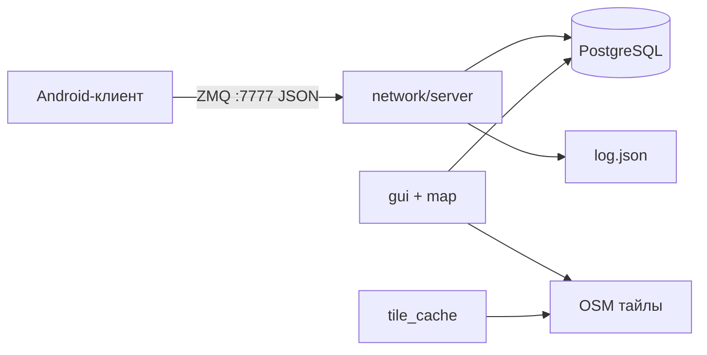

# Network Analyzer

Десктопное приложение для приёма, хранения и визуализации телеметрии мобильной сети с Android-устройства. Данные сохраняются в PostgreSQL, графический интерфейс отображает карту, тепловую карту сигнала и графики в реальном времени.

## Функциональные возможности

### Приём данных (ZMQ-сервер)

- Слушает порт **7777** (протокол ZeroMQ, режим REQ/REP).
- Принимает JSON-пакеты от мобильного клиента с полями геолокации (`lat`, `lon`, `alt`, `acc`) и данными сот (`cell_data.cells`).
- Поддерживает типы сетей **LTE**, **NR** и **GSM**: извлекает RSRP, RSRQ, RSSI.
- Сохраняет каждую запись в PostgreSQL (таблица `network_logs`).
- Дублирует сырые пакеты в локальный файл `log.json`.
- Отвечает клиенту строкой `OK`.

### База данных

- PostgreSQL 15 (контейнер Docker).
- Таблица `network_logs`: координаты, высота, точность, тип сети, RSRP, RSRQ, RSSI, метка времени.
- При первом запуске выполняется скрипт инициализации `db/init/1-init.sql` (схема и, при наличии, исторические данные).
- Загрузка истории из БД в память для построения графиков и heatmap.

### Графический интерфейс

| Окно | Назначение |
|------|------------|
| **Current stats** | Текущий тип сети, RSRP, координаты, счётчик пакетов за сессию |
| **Signal Graph** | Графики сигнала в реальном времени по PCI (Physical Cell ID) |
| **Full Signal History** | История RSRP / RSRQ / RSSI по данным из БД |
| **Movement Route** | Интерактивная карта: тайлы OpenStreetMap, маршрут, тепловая карта |
| **Heatmap Settings** | Режимы отображения: RSRP, RSRQ, RSSI, высота (Altitude) |
| **Filters / Status** | Включение/выключение сервера и индикаторы состояния |
| **Log Control** | Повторная загрузка данных из БД |

### Карта и тепловая карта

- Фоновая загрузка картографических тайлов (кэш на диске, загрузка через libcurl).
- Проекция Web Mercator.
- Генерация тепловой карты по накопленным точкам измерений.

### Android-клиент

В репозитории подключён субмодуль `Android-project` - мобильное приложение для сбора данных о сотах и геолокации. Собирается отдельно в Android Studio и отправляет данные на десктопный сервер по сети.

### Вспомогательные материалы

- `generate_init_sql.py` - конвертация `log.json` в SQL для первичного наполнения БД.

---

## Структура проекта

```
Android-backend/
├── src/                          # Исходный код приложения
│   ├── core/                     # Точка входа, общие структуры данных
│   │   ├── main.cpp              # Запуск БД, ZMQ-сервера, GUI, загрузчика тайлов
│   │   ├── data_structures.h/cpp # Telemetry, OfflineData, SignalHistory
│   ├── network/                  # ZMQ-сервер приёма данных от Android
│   │   ├── server.h/cpp
│   ├── database/                 # Подключение к PostgreSQL, INSERT/SELECT
│   │   ├── database.h/cpp
│   ├── gui/                      # Интерфейс ImGui + ImPlot
│   │   ├── gui.h/cpp
│   └── map/                      # Карта, тайлы, тепловая карта
│       ├── mercator.h/cpp        # Проекция и координаты тайлов
│       ├── tile_cache.h/cpp      # Кэш и фоновая загрузка тайлов
│       └── heatmap_render.h/cpp  # Генерация и отрисовка heatmap
├── third_party/                  # Зависимости
│   ├── imgui/                    # UI-фреймворк
│   ├── implot/                   # Графики
│   └── json/                     # nlohmann/json
├── db/
│   └── init/
│       └── 1-init.sql            # Схема БД и начальные данные
├── Android-project/              # Android-клиент (git submodule)
├── examples/                     # Примеры клиентов/серверов из прошлых работ
├── Dockerfile                    # Сборка C++-приложения в контейнере
├── docker-compose.yml            # PostgreSQL + приложение
├── script.sh                     # Скрипт быстрого запуска
├── CMakeLists.txt                # Конфигурация сборки
└── generate_init_sql.py          # Генерация SQL из log.json
```

### Архитектура при запуске



При старте `main` поднимает три параллельных потока работы:

1. **TileWorker** - фоновая загрузка картографических тайлов.
2. **RunServer** - приём телеметрии по ZMQ и запись в БД.
3. **RunGUI** - отрисовка интерфейса (блокирующий цикл до закрытия окна).

---

## Требования

### Обязательно: Docker

Для запуска всего стека **необходим установленный Docker** с поддержкой Compose.

Docker используется для:

- сборки C++-приложения в изолированной среде (Ubuntu 22.04, CMake, зависимости);
- запуска контейнера **PostgreSQL 15** с автоматической инициализацией БД;
- запуска GUI-приложения с пробросом X11-дисплея хоста.

Без Docker можно собрать проект вручную на Linux (см. `CMakeLists.txt`), но штатный способ развёртывания - через контейнеры.

### Окружение хоста

Скрипт `script.sh` рассчитан на **Linux** с графической подсистемой **X11**:

- переменная `DISPLAY` должна указывать на активный X-сервер;
- для доступа контейнера к экрану выполняется `xhost +local:docker`;
- пакет `x11-xserver-utils` (в скрипте - `x11-server-utils`).

### Дополнительно

- **Git** - для клонирования репозитория и инициализации submodules.
- **Python 3** - только если нужно перегенерировать `db/init/1-init.sql` из `log.json`.

---

## Запуск через script.sh

### 1. Клонирование

```bash
git clone <url-репозитория> Android-backend
cd Android-backend
```

### 2. Запуск скрипта

```bash
chmod +x script.sh
./script.sh
```

Скрипт выполняет:

1. Подключение git submodules (`implot`, `imgui`) и их обновление.
2. Установку `x11-xserver-utils` (через `apt-get`).
3. Разрешение Docker доступа к X11: `xhost +local:docker`.
4. Сборку и запуск контейнеров: `docker-compose up -d --build`.

### 3. Что поднимается

| Сервис | Контейнер | Порт / доступ |
|--------|-----------|----------------|
| PostgreSQL | `notes_postgres` | `localhost:5434` → 5432 внутри контейнера |
| Приложение | `notes_app` | ZMQ **7777**, GUI через X11 |

Приложение стартует после прохождения healthcheck базы данных.

### 4. Остановка

```bash
# Остановить контейнеры
docker compose down
# или
docker-compose down

# Остановить и удалить том с данными БД
docker-compose down -v
```

Переменные подключения к БД (задаются в `docker-compose.yml`):

| Переменная | Значение по умолчанию |
|------------|----------------------|
| `DB_HOST` | `localhost` (в контейнере app - host network) |
| `DB_PORT` | `5434` |
| `DB_NAME` | `android_backend` |
| `DB_USER` | `postgres` |
| `DB_PASSWORD` | `somepassword` |

---

## Подготовка исторических данных (опционально)

Если есть файл логов `log.json` в формате построчного JSON:

```bash
python3 generate_init_sql.py log.json db/init/1-init.sql
```

После этого пересоздайте том БД (`docker-compose down -v`) и запустите скрипт, чтобы PostgreSQL выполнил обновлённый скрипт инициализации.

---